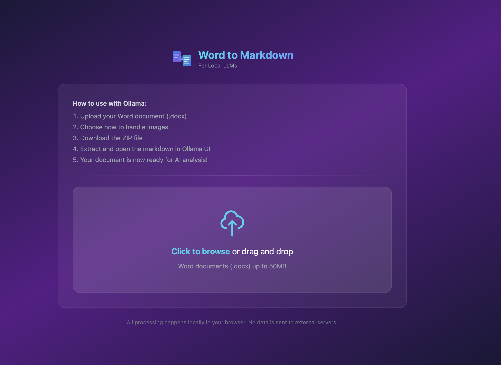

# Word to Markdown

<p align="center">
  
</p>

<p align="center">
  <strong>Convert Word documents to LLM-ready Markdown</strong>
</p>

<p align="center">
  A simple, elegant web application that converts Word documents (.docx) to clean Markdown format, perfect for use with local LLMs like Ollama.
</p>

<p align="center">
  <a href="#features">Features</a> •
  <a href="#demo">Demo</a> •
  <a href="#installation">Installation</a> •
  <a href="#usage">Usage</a> •
  <a href="#contributing">Contributing</a> •
  <a href="#license">License</a>
</p>

---

## Features

- **Drag & Drop Interface** - Simply drag your Word document or click to browse
- **Three Image Handling Modes**:
  - **Separate Images** (Recommended) - Clean markdown with images in a folder
  - **Base64 Embedded** - Single file with embedded images
  - **Text Only** - Lightweight output without images
- **ZIP Bundle Output** - Download everything in a ready-to-use package
- **Dark Glassmorphic UI** - Modern, beautiful interface
- **100% Client-Side** - All processing happens in your browser
- **Privacy First** - No data ever leaves your computer
- **Optimized for LLMs** - Clean markdown output perfect for AI analysis

## Demo



## Installation

### Prerequisites

- [Node.js](https://nodejs.org/) (v18 or higher)
- npm (comes with Node.js)

### Quick Start

```bash
# Clone the repository
git clone https://github.com/yourusername/word-to-markdown.git
cd word-to-markdown

# Install dependencies
npm install

# Start the development server
npm run dev
```

The app will be available at `http://localhost:3000`

### Production Build

```bash
# Build for production
npm run build

# Preview the production build
npm run preview
```

## Usage

### Converting a Document

1. **Open the app** - Navigate to `http://localhost:3000` in your browser
2. **Upload your document** - Drag and drop a `.docx` file or click to browse
3. **Choose image handling** - Select how you want images to be processed
4. **Convert** - Click "Convert to Markdown"
5. **Download** - Get your ZIP bundle with markdown and images

### Using with Ollama

1. Extract the downloaded ZIP file
2. Open the markdown file in your text editor
3. Copy the content into Ollama's chat interface
4. Your document is ready for AI analysis!

### Image Handling Options

| Mode | Description | Best For |
|------|-------------|----------|
| **Separate Images** | Images saved in a folder, markdown references them | Most LLMs, clean output |
| **Base64 Embedded** | Images encoded directly in markdown | Single-file convenience |
| **Text Only** | Images replaced with placeholders | Text-only LLMs, smallest size |

## Tech Stack

- **[React 19](https://react.dev/)** - UI framework
- **[TypeScript](https://www.typescriptlang.org/)** - Type safety
- **[Vite](https://vitejs.dev/)** - Build tool
- **[Tailwind CSS](https://tailwindcss.com/)** - Styling
- **[Mammoth.js](https://github.com/mwilliamson/mammoth.js)** - Word document parsing
- **[JSZip](https://stuk.github.io/jszip/)** - ZIP file generation
- **[Turndown](https://github.com/mixmark-io/turndown)** - HTML to Markdown conversion

## Project Structure

```
word-to-markdown/
├── src/
│   ├── components/       # React components
│   │   ├── Logo.tsx
│   │   ├── DropZone.tsx
│   │   ├── ImageOptions.tsx
│   │   ├── ConvertButton.tsx
│   │   ├── ProgressIndicator.tsx
│   │   └── DownloadSection.tsx
│   ├── utils/            # Utility functions
│   │   ├── converter.ts  # Word to Markdown conversion
│   │   └── zipGenerator.ts
│   ├── types/            # TypeScript types
│   │   └── index.ts
│   ├── App.tsx           # Main application
│   ├── main.tsx          # Entry point
│   └── index.css         # Global styles
├── public/               # Static assets
├── package.json
├── vite.config.ts
├── tailwind.config.js
└── tsconfig.json
```

## Browser Support

- Chrome/Edge (latest)
- Firefox (latest)
- Safari (latest)

Requires a modern browser with File API support.

## Limitations

- Only `.docx` files are supported (not `.doc`)
- Maximum file size: 200MB
- Complex formatting may not convert perfectly
- Track changes and comments are not preserved

## Contributing

Contributions are welcome! Please see our [Contributing Guide](CONTRIBUTING.md) for details.

### Development

```bash
# Install dependencies
npm install

# Start development server with hot reload
npm run dev

# Run linter
npm run lint

# Build for production
npm run build
```

## License

This project is licensed under the MIT License - see the [LICENSE](LICENSE) file for details.

## Acknowledgments

- [Mammoth.js](https://github.com/mwilliamson/mammoth.js) for excellent Word document parsing
- [Ollama](https://ollama.ai/) for making local LLMs accessible
- All our [contributors](https://github.com/yourusername/word-to-markdown/graphs/contributors)

---

<p align="center">
  Made with ❤️ for the open source community
</p>
